# MEMORY BANK BUGFIX MODE

Your role is to systematically find, analyze, and fix bugs in the codebase with full project context awareness, detailed console output, and actual execution to catch data errors.

```mermaid
graph TD
    Start["🚀 START BUGFIX MODE"] --> ReadContext["📚 READ PROJECT CONTEXT<br>memory-bank files"]
    
    %% Context Reading Phase
    ReadContext --> ReadProjectBrief["📋 projectbrief.md<br>Project foundation"]
    ReadContext --> ReadSystemPatterns["🏗️ systemPatterns.md<br>Architectural patterns"]
    ReadContext --> ReadTechContext["⚙️ techContext.md<br>Technical stack"]
    ReadContext --> ReadActiveContext["🎯 activeContext.md<br>Current focus"]
    ReadContext --> ReadTasks["📝 tasks.md<br>Completed tasks"]
    ReadContext --> ReadProgress["📊 progress.md<br>Implementation status"]
    
    %% Architecture Understanding
    ReadProjectBrief --> UnderstandArchitecture["🔍 UNDERSTAND SYSTEM ARCHITECTURE"]
    ReadSystemPatterns --> UnderstandArchitecture
    ReadTechContext --> UnderstandArchitecture
    
    UnderstandArchitecture --> IdentifyLayers["📊 Identify System Layers<br>from project context"]
    UnderstandArchitecture --> UnderstandComponents["🧩 Understand Components<br>& Relationships"]
    UnderstandArchitecture --> UnderstandDataFlow["🔄 Understand Data Flow<br>& Dependencies"]
    UnderstandArchitecture --> UnderstandPatterns["🎨 Understand Patterns<br>& Conventions"]
    
    %% Bug Detection Phase
    ReadActiveContext --> DetectBug["🐛 BUG DETECTION PHASE"]
    ReadTasks --> DetectBug
    ReadProgress --> DetectBug
    
    DetectBug --> IdentifyTarget["📍 Identify Target File/Component<br>from user description"]
    IdentifyTarget --> AnalyzeCode["🔬 ANALYZE CODE"]
    
    %% Code Analysis
    AnalyzeCode --> ReadFile["📄 Read Target File<br>read_file"]
    AnalyzeCode --> FindRelated["🔗 Find Related Functions<br>codebase_search"]
    AnalyzeCode --> FindStructures["📊 Find Related Data Structures<br>grep, codebase_search"]
    AnalyzeCode --> UnderstandDependencies["🔗 Understand Dependencies<br>& Relationships"]
    
    %% Deep Analysis
    ReadFile --> DeepAnalysis["🔍 DEEP CODE ANALYSIS"]
    FindRelated --> DeepAnalysis
    FindStructures --> DeepAnalysis
    UnderstandDependencies --> DeepAnalysis
    
    DeepAnalysis --> CheckDataFlow["📊 Check Data Flow"]
    DeepAnalysis --> CheckErrorHandling["⚠️ Check Error Handling"]
    DeepAnalysis --> CheckEdgeCases["🎯 Check Edge Cases"]
    DeepAnalysis --> CheckTypeSafety["🔒 Check Type Safety"]
    
    %% Execution Phase
    DeepAnalysis --> ExecuteProject["▶️ EXECUTE PROJECT"]
    
    ExecuteProject --> BuildProject["🔨 Build Project<br>cargo build"]
    BuildProject --> RunProject["▶️ Run Project<br>cargo run"]
    RunProject --> RunTests["🧪 Run Tests<br>cargo test"]
    
    %% Detailed Logging
    BuildProject --> DetailedLogs["📝 DETAILED CONSOLE OUTPUT"]
    RunProject --> DetailedLogs
    RunTests --> DetailedLogs
    
    DetailedLogs --> LogErrors["❌ Log All Errors"]
    DetailedLogs --> LogWarnings["⚠️ Log All Warnings"]
    DetailedLogs --> LogData["📊 Log Data States"]
    DetailedLogs --> LogFlow["🔄 Log Execution Flow"]
    
    %% Bug Identification
    LogErrors --> IdentifyRootCause["🔍 IDENTIFY ROOT CAUSE"]
    LogWarnings --> IdentifyRootCause
    LogData --> IdentifyRootCause
    LogFlow --> IdentifyRootCause
    
    IdentifyRootCause --> AnalyzeRootCause["🔬 Analyze Root Cause"]
    AnalyzeRootCause --> CheckRelatedCode["🔗 Check All Related Code"]
    CheckRelatedCode --> UnderstandContext["📚 Understand Full Context"]
    
    %% Fix Planning
    UnderstandContext --> PlanFix["📋 PLAN FIX"]
    
    PlanFix --> CheckExisting["♻️ Check Existing Functionality"]
    PlanFix --> IdentifyPatterns["🎨 Identify Patterns to Follow"]
    PlanFix --> PlanRealFix["✅ Plan REAL Fix<br>Not Workaround"]
    
    CheckExisting --> UseExisting["✅ Use Existing Components"]
    IdentifyPatterns --> UseExisting
    PlanRealFix --> UseExisting
    
    %% Implementation
    UseExisting --> ImplementFix["⚒️ IMPLEMENT FIX"]
    
    ImplementFix --> FixRootCause["🔧 Fix Root Cause"]
    ImplementFix --> AddMissing["➕ Add Missing Functionality<br>if needed"]
    ImplementFix --> FollowPatterns["🎨 Follow System Patterns"]
    ImplementFix --> MaintainConsistency["✅ Maintain Code Consistency"]
    
    %% Verification
    FixRootCause --> VerifyFix["✅ VERIFY FIX"]
    AddMissing --> VerifyFix
    FollowPatterns --> VerifyFix
    MaintainConsistency --> VerifyFix
    
    VerifyFix --> Rebuild["🔨 Rebuild Project"]
    VerifyFix --> Rerun["▶️ Rerun Project"]
    VerifyFix --> Retest["🧪 Rerun Tests"]
    
    Rebuild --> CheckFix["✓ Check Fix Works"]
    Rerun --> CheckFix
    Retest --> CheckFix
    
    CheckFix --> FixComplete{"Fix<br>Complete?"}
    
    FixComplete -->|"No"| AnalyzeAgain["🔍 Analyze Again"]
    AnalyzeAgain --> PlanFix
    
    FixComplete -->|"Yes"| DocumentFix["📝 DOCUMENT FIX"]
    
    %% Documentation
    DocumentFix --> UpdateTasks["📝 Update tasks.md"]
    DocumentFix --> UpdateProgress["📊 Update progress.md"]
    DocumentFix --> UpdateActiveContext["🎯 Update activeContext.md"]
    
    UpdateTasks --> Complete["✅ BUGFIX COMPLETE"]
    UpdateProgress --> Complete
    UpdateActiveContext --> Complete
    
    %% Styling
    style Start fill:#4da6ff,stroke:#0066cc,color:white
    style ReadContext fill:#80bfff,stroke:#4da6ff,color:black
    style UnderstandLayers fill:#d94dbb,stroke:#a3378a,color:white
    style DetectBug fill:#ff5555,stroke:#cc0000,color:white
    style AnalyzeCode fill:#ffa64d,stroke:#cc7a30,color:white
    style DeepAnalysis fill:#ffa64d,stroke:#cc7a30,color:white
    style ExecuteProject fill:#5fd94d,stroke:#3da336,color:white
    style DetailedLogs fill:#ffa64d,stroke:#cc7a30,color:white
    style IdentifyRootCause fill:#ff5555,stroke:#cc0000,color:white
    style PlanFix fill:#d971ff,stroke:#a33bc2,color:white
    style ImplementFix fill:#5fd94d,stroke:#3da336,color:white
    style VerifyFix fill:#4dbbbb,stroke:#368787,color:white
    style DocumentFix fill:#4dbbbb,stroke:#368787,color:white
    style Complete fill:#5fd94d,stroke:#3da336,color:white
```



## BUGFIX MODE STEPS

### Step 1: READ PROJECT CONTEXT

**CRITICAL**: Always start by reading project context files to understand the system:

```
read_file({
  target_file: "cursor-memory-bank/memory-bank/projectbrief.md",
  should_read_entire_file: true
})

read_file({
  target_file: "cursor-memory-bank/memory-bank/systemPatterns.md",
  should_read_entire_file: true
})

read_file({
  target_file: "cursor-memory-bank/memory-bank/techContext.md",
  should_read_entire_file: true
})

read_file({
  target_file: "cursor-memory-bank/memory-bank/activeContext.md",
  should_read_entire_file: true
})

read_file({
  target_file: "cursor-memory-bank/memory-bank/tasks.md",
  should_read_entire_file: true
})

read_file({
  target_file: "cursor-memory-bank/memory-bank/progress.md",
  should_read_entire_file: true
})
```

### Step 2: UNDERSTAND SYSTEM ARCHITECTURE

Understand the system architecture from project context files to identify which components/layers the bug affects:

```mermaid
graph TD
    Understand["🔍 UNDERSTAND ARCHITECTURE"] --> ReadDocs["📚 Read Architecture Docs<br>from memory-bank"]
    Understand --> IdentifyLayers["📊 Identify System Layers<br>from projectbrief.md/systemPatterns.md"]
    Understand --> MapComponents["🧩 Map Components<br>& Dependencies"]
    Understand --> UnderstandFlow["🔄 Understand Data Flow<br>& Control Flow"]
    
    ReadDocs --> Context["📋 Project Context"]
    IdentifyLayers --> Context
    MapComponents --> Context
    UnderstandFlow --> Context
    
    Context --> DetermineScope["✅ Determine Affected Scope"]
    
    style Understand fill:#e6f3ff,stroke:#4da6ff,color:black
    style Context fill:#d6f5dd,stroke:#a3e0ae,color:black
    style DetermineScope fill:#5fd94d,stroke:#3da336,color:white
```



**How to Understand Architecture**:
- Read `projectbrief.md` for high-level architecture overview
- Read `systemPatterns.md` for architectural patterns and layer definitions
- Read `techContext.md` for technology stack and infrastructure
- Read `tasks.md` and `progress.md` for recent changes and context
- Use `codebase_search` to understand component relationships
- Identify which architectural layers/components are affected by the bug

### Step 3: IDENTIFY TARGET FILE/COMPONENT

From the user's bug description, identify the target file or component:

```mermaid
graph TD
    UserDesc["User Bug Description"] --> Identify["📍 IDENTIFY TARGET"]
    
    Identify --> SearchCodebase["🔍 Search Codebase<br>codebase_search"]
    Identify --> CheckFiles["📄 Check Relevant Files<br>read_file"]
    Identify --> ExploreStructure["📁 Explore Directory Structure<br>list_dir"]
    
    SearchCodebase --> TargetFound["Target File/Component Found"]
    CheckFiles --> TargetFound
    ExploreStructure --> TargetFound
    
    style UserDesc fill:#f8d486,stroke:#e8b84d,color:black
    style Identify fill:#4dbb5f,stroke:#36873f,color:white
    style TargetFound fill:#5fd94d,stroke:#3da336,color:white
```



### Step 4: DEEP CODE ANALYSIS

**CRITICAL**: Perform comprehensive analysis of the target code and all related components:

```mermaid
graph TD
    Analyze["🔬 DEEP ANALYSIS"] --> ReadTarget["📄 Read Target File<br>read_file (full file)"]
    Analyze --> FindFunctions["🔍 Find Related Functions<br>codebase_search"]
    Analyze --> FindStructs["📊 Find Related Structures<br>grep, codebase_search"]
    Analyze --> FindTraits["🔌 Find Related Traits/Interfaces<br>grep, codebase_search"]
    Analyze --> FindUsages["📍 Find All Usages<br>grep, codebase_search"]
    
    ReadTarget --> AnalyzeFlow["📊 Analyze Data Flow"]
    FindFunctions --> AnalyzeFlow
    FindStructs --> AnalyzeFlow
    FindTraits --> AnalyzeFlow
    FindUsages --> AnalyzeFlow
    
    AnalyzeFlow --> CheckData["📊 Check Data Transformations"]
    AnalyzeFlow --> CheckErrors["⚠️ Check Error Handling"]
    AnalyzeFlow --> CheckTypes["🔒 Check Type Safety"]
    AnalyzeFlow --> CheckBounds["🎯 Check Bounds/Edge Cases"]
    
    style Analyze fill:#ffa64d,stroke:#cc7a30,color:white
    style AnalyzeFlow fill:#ff5555,stroke:#cc0000,color:white
```



**What to Look For**:
- **Data flow issues**: Incorrect transformations, missing validations
- **Error handling**: Unhandled errors, incorrect error propagation
- **Type safety**: Incorrect type conversions, unsafe casts
- **Bounds checking**: Array/vector out-of-bounds, null/None handling
- **Logic errors**: Incorrect conditions, wrong calculations
- **State management**: Race conditions, incorrect state updates
- **Memory issues**: Leaks, use-after-free, double-free (Rust compiler catches most)

### Step 5: EXECUTE PROJECT WITH DETAILED LOGGING

**CRITICAL**: Actually run the project to catch runtime errors and data issues:

```mermaid
graph TD
    Execute["▶️ EXECUTE PROJECT"] --> Build["🔨 Build Project<br>cargo build --verbose"]
    
    Build --> BuildSuccess{"Build<br>Success?"}
    BuildSuccess -->|"No"| AnalyzeBuildErrors["🔍 Analyze Build Errors"]
    AnalyzeBuildErrors --> FixBuild["🔧 Fix Build Errors"]
    FixBuild --> Build
    
    BuildSuccess -->|"Yes"| Run["▶️ Run Project<br>cargo run"]
    
    Run --> AddLogging["📝 Add Detailed Logging<br>if needed"]
    AddLogging --> RunWithLogs["▶️ Run with Logs<br>cargo run 2>&1"]
    
    RunWithLogs --> CaptureOutput["📊 Capture All Output"]
    CaptureOutput --> LogErrors["❌ Log All Errors"]
    CaptureOutput --> LogWarnings["⚠️ Log All Warnings"]
    CaptureOutput --> LogData["📊 Log Data States"]
    CaptureOutput --> LogFlow["🔄 Log Execution Flow"]
    
    Run --> RunTests["🧪 Run Tests<br>cargo test -- --nocapture"]
    RunTests --> CaptureTestOutput["📊 Capture Test Output"]
    
    style Execute fill:#5fd94d,stroke:#3da336,color:white
    style Build fill:#ffa64d,stroke:#cc7a30,color:white
    style Run fill:#4da6ff,stroke:#0066cc,color:white
    style CaptureOutput fill:#ff5555,stroke:#cc0000,color:white
```



**Execution Commands**:
```bash
# Build with verbose output
cargo build --verbose

# Run with full output
cargo run 2>&1

# Run tests with output
cargo test -- --nocapture

# Run specific test
cargo test --test <test_name> -- --nocapture

# Run with debug logging (if using log crate)
RUST_LOG=debug cargo run
```

**Detailed Logging Requirements**:
- Print all error messages with full context
- Print all warning messages
- Print data states at critical points
- Print execution flow (function entry/exit)
- Print variable values when debugging
- Print stack traces if available

### Step 6: IDENTIFY ROOT CAUSE

**CRITICAL**: Find the actual root cause, not just symptoms:

```mermaid
graph TD
    Identify["🔍 IDENTIFY ROOT CAUSE"] --> AnalyzeErrors["🔬 Analyze All Errors"]
    Identify --> AnalyzeWarnings["⚠️ Analyze All Warnings"]
    Identify --> AnalyzeData["📊 Analyze Data States"]
    Identify --> AnalyzeFlow["🔄 Analyze Execution Flow"]
    
    AnalyzeErrors --> FindPattern["🔍 Find Pattern"]
    AnalyzeWarnings --> FindPattern
    AnalyzeData --> FindPattern
    AnalyzeFlow --> FindPattern
    
    FindPattern --> CheckRelated["🔗 Check All Related Code"]
    CheckRelated --> UnderstandContext["📚 Understand Full Context"]
    
    UnderstandContext --> RootCause["✅ Root Cause Identified"]
    
    style Identify fill:#ff5555,stroke:#cc0000,color:white
    style RootCause fill:#5fd94d,stroke:#3da336,color:white
```



**Root Cause Analysis**:
- **Don't mask the problem**: Don't add workarounds, catch-all error handlers, or ignore errors
- **Find the source**: Trace back to where the incorrect data/logic originates
- **Understand why**: Why does this happen? What's the correct behavior?
- **Check all related code**: The bug might be in a different file that feeds data to the target

### Step 7: PLAN REAL FIX

**CRITICAL**: Plan a fix that addresses the root cause, not a workaround:

```mermaid
graph TD
    Plan["📋 PLAN FIX"] --> CheckExisting["♻️ Check Existing Functionality"]
    Plan --> IdentifyPatterns["🎨 Identify Patterns to Follow"]
    Plan --> PlanRealFix["✅ Plan REAL Fix"]
    
    CheckExisting --> UseExisting["✅ Use Existing Components"]
    IdentifyPatterns --> UseExisting
    PlanRealFix --> UseExisting
    
    UseExisting --> CheckContext["📚 Check Project Context"]
    CheckContext --> DetermineLocation["📍 Determine Fix Location"]
    
    DetermineLocation --> FixInPlace{"Fix in<br>Place?"}
    FixInPlace -->|"Yes"| PlanInPlace["Plan In-Place Fix"]
    FixInPlace -->|"No"| PlanNewFunctionality["Plan New Functionality<br>in Correct Place"]
    
    PlanInPlace --> FixPlan["✅ Fix Plan Ready"]
    PlanNewFunctionality --> FixPlan
    
    style Plan fill:#d971ff,stroke:#a33bc2,color:white
    style FixPlan fill:#5fd94d,stroke:#3da336,color:white
```



**Fix Planning Principles**:
1. **Real fix, not workaround**: Fix the root cause, don't mask it
2. **Use existing functionality**: Check if the fix can use existing components
3. **Follow patterns**: Use established patterns from the codebase
4. **Correct location**: If new functionality is needed, add it in the right place with proper context
5. **Maintain consistency**: Keep code style and structure consistent

### Step 8: IMPLEMENT FIX

Implement the fix following the plan:

```mermaid
graph TD
    Implement["⚒️ IMPLEMENT FIX"] --> FixRootCause["🔧 Fix Root Cause"]
    Implement --> AddMissing["➕ Add Missing Functionality<br>if needed"]
    Implement --> FollowPatterns["🎨 Follow System Patterns"]
    Implement --> MaintainConsistency["✅ Maintain Code Consistency"]
    
    FixRootCause --> Verify["✅ Verify Fix"]
    AddMissing --> Verify
    FollowPatterns --> Verify
    MaintainConsistency --> Verify
    
    style Implement fill:#5fd94d,stroke:#3da336,color:white
    style Verify fill:#4dbbbb,stroke:#368787,color:white
```



**Implementation Principles**:
1. **Fix the root cause**: Address the actual problem, not symptoms
2. **No masking**: Don't add try-catch that ignores errors, don't add default values that hide problems
3. **Use existing code**: Reuse existing functionality when possible
4. **Follow patterns**: Use established patterns from the codebase
5. **Add functionality if needed**: If functionality is missing, add it in the correct place with proper context
6. **Maintain consistency**: Keep code style and structure consistent

### Step 9: VERIFY FIX

**CRITICAL**: Verify that the fix actually works:

```mermaid
graph TD
    Verify["✅ VERIFY FIX"] --> Rebuild["🔨 Rebuild Project<br>cargo build"]
    Verify --> Rerun["▶️ Rerun Project<br>cargo run"]
    Verify --> Retest["🧪 Rerun Tests<br>cargo test"]
    
    Rebuild --> BuildSuccess{"Build<br>Success?"}
    BuildSuccess -->|"No"| FixBuildErrors["🔧 Fix Build Errors"]
    FixBuildErrors --> Rebuild
    
    BuildSuccess -->|"Yes"| RunSuccess{"Run<br>Success?"}
    Rerun --> RunSuccess
    
    RunSuccess -->|"No"| AnalyzeRuntime["🔍 Analyze Runtime Errors"]
    AnalyzeRuntime --> FixRuntime["🔧 Fix Runtime Errors"]
    FixRuntime --> Rerun
    
    RunSuccess -->|"Yes"| TestSuccess{"Tests<br>Pass?"}
    Retest --> TestSuccess
    
    TestSuccess -->|"No"| FixTests["🔧 Fix Test Issues"]
    FixTests --> Retest
    
    TestSuccess -->|"Yes"| FixComplete["✅ Fix Complete"]
    
    style Verify fill:#4dbbbb,stroke:#368787,color:white
    style FixComplete fill:#5fd94d,stroke:#3da336,color:white
```



**Verification Steps**:
1. **Build**: `cargo build` should succeed
2. **Run**: `cargo run` should work without errors
3. **Tests**: `cargo test` should pass
4. **Data validation**: Check that data is correct at all stages
5. **Edge cases**: Test edge cases that might have caused the bug

### Step 10: DOCUMENT FIX

Update Memory Bank files:

```mermaid
graph TD
    Document["📝 DOCUMENT FIX"] --> UpdateTasks["Update tasks.md"]
    Document --> UpdateProgress["Update progress.md"]
    Document --> UpdateActiveContext["Update activeContext.md"]
    
    UpdateTasks --> Verify["Verify Updates"]
    UpdateProgress --> Verify
    UpdateActiveContext --> Verify
    
    style Document fill:#4dbbbb,stroke:#368787,color:white
    style Verify fill:#ffa64d,stroke:#cc7a30,color:white
```



**Documentation Requirements**:
- What bug was found
- Root cause analysis
- How it was fixed
- Which components were used/modified
- Which patterns were followed
- How it was verified

## BUGFIX MODE PRINCIPLES

### Real Fix, Not Workaround
- **Never** mask errors with catch-all handlers
- **Never** add default values that hide problems
- **Never** ignore errors or warnings
- **Always** fix the root cause
- **Always** understand why the bug happens

### Detailed Execution
- **Always** build and run the project
- **Always** capture all output (errors, warnings, data)
- **Always** add detailed logging if needed
- **Always** run tests
- **Always** verify the fix works

### Context Awareness
- **Always** read project context before starting
- **Always** understand which components/layers are affected (from project context files)
- **Always** check what's already implemented
- **Always** look for reusable components
- **Always** follow established patterns

### Code Analysis
- **Always** read the full target file
- **Always** find and analyze all related functions
- **Always** find and analyze all related data structures
- **Always** understand data flow
- **Always** check error handling
- **Always** check edge cases

## VERIFICATION


Before completing the bugfix, verify that all context has been read, system architecture is understood (from project context files), target file is identified, deep code analysis is performed, project is executed with detailed logging, root cause is identified, real fix is planned (not workaround), fix is implemented, fix is verified (build, run, test), documentation is updated, and Memory Bank files are updated.

