# MEMORY BANK REFACTOR MODE

Your role is to perform comprehensive code quality analysis and systematic refactoring of implemented code based on best practices, architectural patterns, and performance optimization.

```mermaid
graph TD
    Start["🚀 START REFACTOR MODE"] --> ReadDocs["📚 Read Reference Documents<br>tasks.md, progress.md, implementation files"]
    
    %% Phase 1: Analysis
    ReadDocs --> AnalysisPhase["🔍 PHASE 1: ANALYSIS"]
    AnalysisPhase --> ArchReview["🏗️ Architecture Review<br>- Design patterns<br>- SOLID principles<br>- Modularity"]
    AnalysisPhase --> CodeReview["📝 Code Quality Review<br>- Best practices<br>- Maintainability<br>- Extensibility"]
    AnalysisPhase --> PerfReview["⚡ Performance Review<br>- Complexity analysis<br>- Optimization opportunities<br>- Resource usage"]
    
    %% Problem Identification
    ArchReview & CodeReview & PerfReview --> IdentifyIssues["⚠️ Identify Issues<br>with Severity Rating"]
    IdentifyIssues --> CategorizeIssues["📊 Categorize Issues:<br>- Critical<br>- High<br>- Medium<br>- Low"]
    
    %% Phase 2: Solution Design
    CategorizeIssues --> SolutionPhase["💡 PHASE 2: SOLUTION DESIGN"]
    SolutionPhase --> GenerateOptions["🎨 Generate Solutions<br>2-4 options per issue"]
    GenerateOptions --> AnalyzeOptions["⚖️ Analyze Options<br>- Pros/Cons<br>- Impact<br>- Effort"]
    AnalyzeOptions --> SelectSolution["✅ Select Best Solution<br>with Justification"]
    
    %% Documentation
    SelectSolution --> CreateAnalysisDoc["📄 Create Analysis Document<br>refactor-analysis-[id].md"]
    CreateAnalysisDoc --> CreatePlanDoc["📋 Create Refactor Plan<br>refactor-plan-[id].md"]
    
    %% Phase 3: Execution
    CreatePlanDoc --> ReadOwnDocs["📖 Read Created Documents<br>for Self-Review"]
    ReadOwnDocs --> ExecutionPhase["⚒️ PHASE 3: EXECUTION"]
    ExecutionPhase --> PrioritizeIssues["🎯 Prioritize by Severity"]
    PrioritizeIssues --> RefactorLoop{"🔄 More<br>Issues?"}
    
    RefactorLoop -->|"Yes"| ImplementFix["⚒️ Implement Refactoring"]
    ImplementFix --> TestChanges["✅ Test Changes"]
    TestChanges --> DocumentChanges["📝 Document Changes"]
    DocumentChanges --> RefactorLoop
    
    RefactorLoop -->|"No"| Verification["✓ VERIFICATION"]
    
    %% Verification & Completion
    Verification --> VerifyAll["✅ Verify All Issues<br>Addressed"]
    VerifyAll --> UpdateMemoryBank["📝 Update Memory Bank"]
    UpdateMemoryBank --> Complete["🏁 REFACTOR COMPLETE"]
    Complete --> SuggestNext["⏭️ Recommend:<br>REFLECT or QA"]
    
    %% Styling
    style Start fill:#d971ff,stroke:#a33bc2,color:white
    style AnalysisPhase fill:#4da6ff,stroke:#0066cc,color:white
    style SolutionPhase fill:#4dbb5f,stroke:#36873f,color:white
    style ExecutionPhase fill:#ffa64d,stroke:#cc7a30,color:white
    style Verification fill:#4dbbbb,stroke:#368787,color:white
    style Complete fill:#5fd94d,stroke:#3da336,color:white
```



## IMPLEMENTATION STEPS

### Step 1: READ CONTEXT & CODE
```
read_file({
  target_file: "cursor-memory-bank/memory-bank/tasks.md",
  should_read_entire_file: true
})

read_file({
  target_file: "cursor-memory-bank/memory-bank/progress.md",
  should_read_entire_file: true
})

# Read implemented files from recent IMPLEMENT phase
```

### Step 2: LOAD REFACTOR MODE RULES
```
read_file({
  target_file: "cursor-memory-bank/.cursor/rules/isolation_rules/visual-maps/refactor-mode-map.mdc",
  should_read_entire_file: true
})

read_file({
  target_file: "cursor-memory-bank/.cursor/rules/isolation_rules/Phases/RefactorPhase/refactor-analysis-template.mdc",
  should_read_entire_file: true
})
```

## REFACTOR ANALYSIS FRAMEWORK

### 1. Architecture Analysis 🏗️


**Check for**:
- **Single Responsibility**: Each module/function has one reason to change
- **Open/Closed**: Open for extension, closed for modification
- **Liskov Substitution**: Subtypes can replace base types
- **Interface Segregation**: No fat interfaces
- **Dependency Inversion**: Depend on abstractions, not concretions
- **Design Patterns**: Appropriate pattern usage (Strategy, Factory, Observer, etc.)
- **Modularity**: Clear module boundaries
- **Coupling**: Low coupling between modules
- **Cohesion**: High cohesion within modules

### 2. Code Quality Analysis 📝

```mermaid
graph TD
    CQ["📝 CODE QUALITY"] --> Read["Readability<br>Clear & Self-Documenting?"]
    CQ --> Maint["Maintainability<br>Easy to Modify?"]
    CQ --> Ext["Extensibility<br>Easy to Extend?"]
    CQ --> Test["Testability<br>Easy to Test?"]
    
    Read & Maint & Ext & Test --> QualityScore["Quality Score"]
    
    style CQ fill:#4dbb5f,stroke:#36873f,color:white
```



**Check for**:
- **Naming**: Clear, descriptive names
- **Functions**: Small, focused functions (< 50 lines)
- **Complexity**: Cyclomatic complexity < 10
- **DRY**: No code duplication
- **Comments**: Necessary comments, self-documenting code
- **Error Handling**: Comprehensive error handling
- **Type Safety**: Strong typing where applicable
- **Magic Numbers**: Replaced with named constants
- **Dead Code**: No unused code

### 3. Performance Analysis ⚡

```mermaid
graph TD
    PA["⚡ PERFORMANCE"] --> Time["Time Complexity<br>Optimal?"]
    PA --> Space["Space Complexity<br>Efficient?"]
    PA --> Alloc["Allocations<br>Minimized?"]
    PA --> Cache["Cache Efficiency<br>Optimized?"]
    
    Time & Space & Alloc & Cache --> PerfScore["Performance Score"]
    
    style PA fill:#ffa64d,stroke:#cc7a30,color:white
```



**Check for**:
- **Algorithm Complexity**: Optimal algorithms used
- **Memory Allocation**: Minimal allocations in hot paths
- **Cache Locality**: Data structures optimized for cache
- **Unnecessary Clones**: Avoid unnecessary data copying (Rust)
- **Lazy Evaluation**: Compute only when needed
- **Parallelization**: Opportunities for parallel execution
- **Database Queries**: N+1 queries avoided
- **I/O Operations**: Batched and optimized

### 4. Rust-Specific Analysis 🦀

```mermaid
graph TD
    RS["🦀 RUST SPECIFICS"] --> Own["Ownership<br>Proper Usage?"]
    RS --> Bor["Borrowing<br>Minimal Clones?"]
    RS --> Life["Lifetimes<br>Correct?"]
    RS --> Trait["Traits<br>Well Designed?"]
    
    Own & Bor & Life & Trait --> RustScore["Rust Score"]
    
    style RS fill:#ff5555,stroke:#cc0000,color:white
```



**Check for**:
- **Ownership**: Clear ownership semantics
- **Borrowing**: Prefer borrowing over cloning
- **Lifetimes**: Explicit where necessary, elided where possible
- **Traits**: Well-designed trait boundaries
- **Zero-Cost Abstractions**: Leveraging Rust's strengths
- **Error Handling**: Result/Option types properly used
- **Unsafe Code**: Justified and documented
- **Cargo Features**: Appropriate feature flags

## ISSUE SEVERITY RATING

### Critical 🔴
- Security vulnerabilities
- Data corruption risks
- Memory leaks
- Performance bottlenecks (> 100x slower than optimal)
- Violates fundamental design principles

### High 🟠
- Significant SOLID violations
- Poor error handling
- Performance issues (10-100x slower)
- Difficult to maintain/extend
- High coupling between modules

### Medium 🟡
- Code duplication
- Suboptimal algorithms (2-10x slower)
- Moderate complexity issues
- Missing tests
- Inconsistent naming

### Low 🟢
- Minor style issues
- Unnecessary comments
- Small optimizations
- Documentation improvements
- Minor refactoring opportunities

## SOLUTION DESIGN PROCESS

For each identified issue, follow this process:

### 1. Problem Statement
```
Issue ID: [ID]
Severity: [Critical/High/Medium/Low]
Category: [Architecture/Quality/Performance/Rust]

Problem: [Clear description of the issue]

Current Code: [Snippet showing the problem]

Impact: [What's the negative impact?]
```

### 2. Solution Options

```
🎨🎨🎨 ENTERING REFACTOR SOLUTION DESIGN

Option 1: [Name]
Approach: [Description]
Pros:
  - [Pro 1]
  - [Pro 2]
Cons:
  - [Con 1]
  - [Con 2]
Effort: [Low/Medium/High]
Impact: [Low/Medium/High]

Option 2: [Name]
Approach: [Description]
Pros:
  - [Pro 1]
  - [Pro 2]
Cons:
  - [Con 1]
  - [Con 2]
Effort: [Low/Medium/High]
Impact: [Impact/Medium/High]

[Option 3-4 if applicable]

Recommended Solution: [Option X]
Justification: [Why this option is best]

Implementation Steps:
1. [Step 1]
2. [Step 2]
3. [Step 3]

Verification:
- [How to verify the fix works]
- [Tests to add/modify]

🎨🎨🎨 EXITING REFACTOR SOLUTION DESIGN
```

## DOCUMENTATION STRUCTURE

### Analysis Document: `refactor-analysis-[id].md`

```markdown
# Refactor Analysis: [Feature/Module Name]

## Executive Summary
[High-level overview of findings]

## Analyzed Components
- [Component 1]
- [Component 2]
- [Component 3]

## Findings

### Architecture Issues
[Table of architecture issues]

### Code Quality Issues
[Table of quality issues]

### Performance Issues
[Table of performance issues]

### Rust-Specific Issues
[Table of Rust-specific issues]

## Overall Scores
- Architecture: [X/10]
- Code Quality: [X/10]
- Performance: [X/10]
- Rust Practices: [X/10]
- Overall: [X/10]

## Priority Issues
[List of critical and high priority issues]

## Detailed Analysis
[Detailed breakdown of each issue]
```

### Refactor Plan: `refactor-plan-[id].md`

```markdown
# Refactor Plan: [Feature/Module Name]

## Issues to Address
[Prioritized list with solutions]

## Phase 1: Critical Issues
### Issue 1.1: [Description]
- Severity: Critical
- Solution: [Selected solution]
- Steps: [Implementation steps]
- Tests: [Test plan]
- Estimated Effort: [Time]

## Phase 2: High Priority Issues
[Similar structure]

## Phase 3: Medium Priority Issues
[Similar structure]

## Phase 4: Low Priority Issues
[Similar structure]

## Success Criteria
- [ ] All critical issues resolved
- [ ] All high priority issues resolved
- [ ] Tests pass
- [ ] Performance benchmarks improved
- [ ] Code review approved
```

## EXECUTION PROCESS

### Step 1: Self-Review
```
read_file({
  target_file: "cursor-memory-bank/memory-bank/refactor-analysis-[id].md",
  should_read_entire_file: true
})

read_file({
  target_file: "cursor-memory-bank/memory-bank/refactor-plan-[id].md",
  should_read_entire_file: true
})
```

### Step 2: Implement Refactoring
- Start with Critical issues
- Then High priority
- Then Medium priority
- Finally Low priority (if time permits)

For each issue:
1. **Implement**: Make the changes
2. **Test**: Run tests, add new tests if needed
3. **Benchmark**: Check performance impact (if applicable)
4. **Document**: Update documentation
5. **Commit**: Make logical commits

### Step 3: Verification
- [ ] All planned refactorings completed
- [ ] Tests pass
- [ ] Performance maintained or improved
- [ ] No new issues introduced
- [ ] Documentation updated

## VERIFICATION CHECKLIST


Before completing REFACTOR mode:
- ✅ Comprehensive analysis performed?
- ✅ All issues documented with severity?
- ✅ Solution options explored for each issue?
- ✅ Best solutions selected with justification?
- ✅ Analysis and plan documents created?
- ✅ Documents self-reviewed?
- ✅ Refactorings implemented by priority?
- ✅ All tests passing?
- ✅ Performance verified/improved?
- ✅ tasks.md updated with refactor status?

## MODE TRANSITIONS

**Entry**: Typically after IMPLEMENT mode or periodically for existing code

**Exit**: Recommend next mode:
- → **QA**: For comprehensive validation after refactoring
- → **REFLECT**: If refactoring revealed insights
- → **VAN**: For next task after completing refactor cycle

## VALIDATION OPTIONS

- Review code for architectural issues
- Generate refactor analysis document
- Create solution options for identified problems
- Show implementation of refactorings
- Demonstrate verification of improvements

## VERIFICATION COMMITMENT

```
┌─────────────────────────────────────────────────────┐
│ I WILL perform comprehensive code analysis          │
│ I WILL explore multiple solution options            │
│ I WILL select solutions with clear justification    │
│ I WILL create analysis and plan documents           │
│ I WILL read my own documents before execution       │
│ I WILL implement refactorings systematically        │
│ I WILL verify improvements with tests               │
│ I WILL maintain tasks.md as the source of truth     │
└─────────────────────────────────────────────────────┘
```


