# MEMORY BANK TASK MODE

Your role is to handle ad-hoc tasks with full project context awareness, understanding system layers, existing components, and leveraging what's already built.

```mermaid
graph TD
    Start["🚀 START TASK MODE"] --> ReadContext["📚 READ PROJECT CONTEXT<br>memory-bank files"]
    
    %% Context Reading Phase
    ReadContext --> ReadProjectBrief["📋 projectbrief.md<br>Project foundation"]
    ReadContext --> ReadSystemPatterns["🏗️ systemPatterns.md<br>Architectural patterns"]
    ReadContext --> ReadTechContext["⚙️ techContext.md<br>Technical stack"]
    ReadContext --> ReadActiveContext["🎯 activeContext.md<br>Current focus"]
    ReadContext --> ReadTasks["📝 tasks.md<br>Completed tasks"]
    ReadContext --> ReadProgress["📊 progress.md<br>Implementation status"]
    
    %% Architecture Understanding
    ReadProjectBrief --> UnderstandLayers["🔍 UNDERSTAND SYSTEM LAYERS"]
    ReadSystemPatterns --> UnderstandLayers
    ReadTechContext --> UnderstandLayers
    
    UnderstandLayers --> Layer1["Layer 1: Infrastructure<br>Storage, Event Bus, DI"]
    UnderstandLayers --> Layer2["Layer 2: Data Model<br>QuoteFrame, Vector, Meta"]
    UnderstandLayers --> Layer3["Layer 3: Indicators<br>Registry, Factory, DAG Engine"]
    UnderstandLayers --> Layer4["Layer 4: Conditions<br>Atomic, Composite, Fuzzy Logic"]
    UnderstandLayers --> Layer5["Layer 5: Strategy<br>Builder, Executor, Presets"]
    UnderstandLayers --> Layer6["Layer 6: Position/Order<br>Management"]
    UnderstandLayers --> Layer7["Layer 7: Risk Management<br>Stop Loss, Take Profit, VaR"]
    UnderstandLayers --> Layer8["Layer 8: Metrics<br>40+ performance metrics"]
    UnderstandLayers --> Layer9["Layer 9: Optimization<br>Search algorithms"]
    UnderstandLayers --> Layer10["Layer 10: Validation<br>Walk-forward, Stats"]
    UnderstandLayers --> Layer11["Layer 11: Live Trading<br>Broker integration"]
    UnderstandLayers --> Layer12["Layer 12: UI/API<br>REST API, Web UI"]
    
    %% Task Analysis
    ReadActiveContext --> AnalyzeTask["🔎 ANALYZE TASK"]
    ReadTasks --> AnalyzeTask
    ReadProgress --> AnalyzeTask
    
    AnalyzeTask --> DetermineScope["📐 Determine Task Scope<br>& Complexity"]
    DetermineScope --> FindLocation["📍 FIND IMPLEMENTATION LOCATION"]
    
    %% Location Finding
    FindLocation --> SearchCodebase["🔍 Search Codebase<br>codebase_search"]
    FindLocation --> CheckFiles["📄 Check Relevant Files<br>read_file"]
    FindLocation --> UnderstandDependencies["🔗 Understand Dependencies<br>& Relationships"]
    
    %% Existing Components Analysis
    SearchCodebase --> AnalyzeExisting["🔬 ANALYZE EXISTING COMPONENTS"]
    CheckFiles --> AnalyzeExisting
    UnderstandDependencies --> AnalyzeExisting
    
    AnalyzeExisting --> IdentifyReusable["♻️ Identify Reusable Components"]
    AnalyzeExisting --> IdentifyPatterns["🎨 Identify Patterns to Follow"]
    AnalyzeExisting --> IdentifyInterfaces["🔌 Identify Interfaces to Use"]
    
    %% Implementation Planning
    IdentifyReusable --> PlanImplementation["📋 PLAN IMPLEMENTATION"]
    IdentifyPatterns --> PlanImplementation
    IdentifyInterfaces --> PlanImplementation
    
    PlanImplementation --> CheckImplementRules["📖 Check IMPLEMENT Mode Rules<br>if applicable"]
    CheckImplementRules --> CreateTaskPlan["✍️ Create Task-Specific Plan"]
    
    %% Implementation Execution
    CreateTaskPlan --> ExecuteImplementation["⚒️ EXECUTE IMPLEMENTATION"]
    
    ExecuteImplementation --> UseExisting["✅ Use Existing Components"]
    ExecuteImplementation --> FollowPatterns["✅ Follow System Patterns"]
    ExecuteImplementation --> MaintainConsistency["✅ Maintain Code Consistency"]
    
    %% Documentation
    UseExisting --> DocumentChanges["📝 DOCUMENT CHANGES"]
    FollowPatterns --> DocumentChanges
    MaintainConsistency --> DocumentChanges
    
    DocumentChanges --> UpdateTasks["📝 Update tasks.md"]
    DocumentChanges --> UpdateProgress["📊 Update progress.md"]
    DocumentChanges --> UpdateActiveContext["🎯 Update activeContext.md"]
    
    %% Verification
    UpdateTasks --> VerifyTask["✅ VERIFY TASK COMPLETION"]
    UpdateProgress --> VerifyTask
    UpdateActiveContext --> VerifyTask
    
    VerifyTask --> TestIntegration["🧪 Test Integration"]
    VerifyTask --> CheckConsistency["✓ Check Code Consistency"]
    VerifyTask --> ValidatePatterns["✓ Validate Pattern Usage"]
    
    TestIntegration --> Complete["✅ TASK COMPLETE"]
    CheckConsistency --> Complete
    ValidatePatterns --> Complete
    
    %% Styling
    style Start fill:#4da6ff,stroke:#0066cc,color:white
    style ReadContext fill:#80bfff,stroke:#4da6ff,color:black
    style UnderstandLayers fill:#d94dbb,stroke:#a3378a,color:white
    style AnalyzeTask fill:#ffa64d,stroke:#cc7a30,color:white
    style FindLocation fill:#4dbb5f,stroke:#36873f,color:white
    style AnalyzeExisting fill:#ff5555,stroke:#cc0000,color:white
    style PlanImplementation fill:#d971ff,stroke:#a33bc2,color:white
    style ExecuteImplementation fill:#5fd94d,stroke:#3da336,color:white
    style DocumentChanges fill:#4dbbbb,stroke:#368787,color:white
    style VerifyTask fill:#ffa64d,stroke:#cc7a30,color:white
    style Complete fill:#5fd94d,stroke:#3da336,color:white
```



## TASK MODE STEPS

### Step 1: READ PROJECT CONTEXT

**CRITICAL**: Always start by reading project context files to understand the system:

```
read_file({
  target_file: "cursor-memory-bank/memory-bank/projectbrief.md",
  should_read_entire_file: true
})

read_file({
  target_file: "cursor-memory-bank/memory-bank/systemPatterns.md",
  should_read_entire_file: true
})

read_file({
  target_file: "cursor-memory-bank/memory-bank/techContext.md",
  should_read_entire_file: true
})

read_file({
  target_file: "cursor-memory-bank/memory-bank/activeContext.md",
  should_read_entire_file: true
})

read_file({
  target_file: "cursor-memory-bank/memory-bank/tasks.md",
  should_read_entire_file: true
})

read_file({
  target_file: "cursor-memory-bank/memory-bank/progress.md",
  should_read_entire_file: true
})
```

### Step 2: UNDERSTAND SYSTEM ARCHITECTURE

Understand the 12-layer architecture:


**Key Layers to Understand**:
1. **Infrastructure**: ClickHouse, Redis, Arrow, Event Bus
2. **Data Model**: QuoteFrame, Vector operations, Meta
3. **Indicators**: Registry, Factory, DAG Execution Engine
4. **Conditions**: Atomic/Composite conditions, Fuzzy logic
5. **Strategy**: Builder, Executor, Presets, Signal management
6. **Position/Order**: Order management, Position management
7. **Risk Management**: Stop Loss, Take Profit, Portfolio Risk
8. **Metrics**: 40+ performance metrics (Sharpe, SQN, Drawdown, etc.)
9. **Optimization**: Search algorithms, Multi-objective optimization
10. **Validation**: Walk-forward, Statistical validation
11. **Live Trading**: Broker integration, Real-time processing
12. **UI/API**: REST API, Web UI, Dashboard

### Step 3: ANALYZE TASK REQUIREMENTS

```mermaid
graph TD
    Analyze["🔎 ANALYZE TASK"] --> UnderstandReq["Understand Requirements"]
    Analyze --> DetermineLayer["Determine Affected Layer(s)"]
    Analyze --> IdentifyDependencies["Identify Dependencies"]
    
    UnderstandReq --> Scope["Define Scope"]
    DetermineLayer --> Scope
    IdentifyDependencies --> Scope
    
    Scope --> Complexity["Assess Complexity"]
    Complexity --> Approach["Choose Approach"]
    
    style Analyze fill:#ffa64d,stroke:#cc7a30,color:white
    style Scope fill:#4dbb5f,stroke:#36873f,color:white
    style Complexity fill:#d971ff,stroke:#a33bc2,color:white
    style Approach fill:#5fd94d,stroke:#3da336,color:white
```



**Questions to Answer**:
- What layer(s) does this task affect?
- What existing components can be reused?
- What patterns should be followed?
- What interfaces need to be used/extended?
- How does this relate to completed tasks?

### Step 4: FIND IMPLEMENTATION LOCATION

**CRITICAL**: Find where to implement the task:

```mermaid
graph TD
    Find["📍 FIND LOCATION"] --> Search["Search Codebase<br>codebase_search"]
    Find --> Explore["Explore Directory Structure<br>list_dir"]
    Find --> Read["Read Relevant Files<br>read_file"]
    
    Search --> Identify["Identify Target Files"]
    Explore --> Identify
    Read --> Identify
    
    Identify --> CheckDependencies["Check Dependencies"]
    CheckDependencies --> UnderstandRelations["Understand Relationships"]
    
    style Find fill:#4dbb5f,stroke:#36873f,color:white
    style Identify fill:#ffa64d,stroke:#cc7a30,color:white
    style UnderstandRelations fill:#5fd94d,stroke:#3da336,color:white
```



**Search Strategies**:
1. Use `codebase_search` with semantic queries about the task
2. Use `list_dir` to explore directory structure
3. Use `grep` to find related code patterns
4. Read files that seem relevant to understand context

### Step 5: ANALYZE EXISTING COMPONENTS

**CRITICAL**: Before implementing, analyze what already exists:

```mermaid
graph TD
    Analyze["🔬 ANALYZE EXISTING"] --> FindSimilar["Find Similar Components"]
    Analyze --> IdentifyPatterns["Identify Patterns"]
    Analyze --> CheckInterfaces["Check Interfaces"]
    Analyze --> ReviewExamples["Review Examples"]
    
    FindSimilar --> Reusable["What Can Be Reused?"]
    IdentifyPatterns --> Reusable
    CheckInterfaces --> Reusable
    ReviewExamples --> Reusable
    
    Reusable --> Plan["Plan How to Use"]
    
    style Analyze fill:#ff5555,stroke:#cc0000,color:white
    style Reusable fill:#4dbb5f,stroke:#36873f,color:white
    style Plan fill:#5fd94d,stroke:#3da336,color:white
```



**What to Look For**:
- **Similar functionality**: Has something similar been implemented?
- **Patterns**: What patterns are used in similar code?
- **Interfaces**: What traits/interfaces should be implemented?
- **Factories**: Are there factories that need to be extended?
- **Registries**: Are there registries that need updates?
- **Examples**: Are there examples in presets or tests?

### Step 6: PLAN IMPLEMENTATION

Create a task-specific plan considering:

```mermaid
graph TD
    Plan["📋 PLAN"] --> UseExisting["Use Existing Components"]
    Plan --> FollowPatterns["Follow System Patterns"]
    Plan --> MaintainConsistency["Maintain Code Consistency"]
    Plan --> ConsiderPerformance["Consider Performance"]
    
    UseExisting --> CheckImplement["Check IMPLEMENT Mode Rules"]
    FollowPatterns --> CheckImplement
    MaintainConsistency --> CheckImplement
    ConsiderPerformance --> CheckImplement
    
    CheckImplement --> CreatePlan["Create Task Plan"]
    
    style Plan fill:#d971ff,stroke:#a33bc2,color:white
    style CheckImplement fill:#80bfff,stroke:#4da6ff,color:black
    style CreatePlan fill:#5fd94d,stroke:#3da336,color:white
```



**If IMPLEMENT Mode Rules Apply**:
```
read_file({
  target_file: "cursor-memory-bank/custom_modes/implement_instructions.md",
  should_read_entire_file: true
})
```

**Plan Should Include**:
- Files to modify/create
- Components to reuse
- Patterns to follow
- Interfaces to implement
- Dependencies to consider
- Testing strategy

### Step 7: EXECUTE IMPLEMENTATION

Follow these principles:

```mermaid
graph TD
    Execute["⚒️ EXECUTE"] --> Reuse["Reuse Existing Code"]
    Execute --> Follow["Follow Patterns"]
    Execute --> Integrate["Integrate Properly"]
    Execute --> Test["Test Thoroughly"]
    
    Reuse --> Document["Document Changes"]
    Follow --> Document
    Integrate --> Document
    Test --> Document
    
    style Execute fill:#5fd94d,stroke:#3da336,color:white
    style Document fill:#4dbbbb,stroke:#368787,color:white
```



**Implementation Principles**:
1. **Reuse First**: Always check if something similar exists
2. **Follow Patterns**: Use established patterns from the codebase
3. **Maintain Consistency**: Keep code style and structure consistent
4. **Performance**: Consider Rust optimizations (zero-cost abstractions)
5. **Safety**: Leverage Rust's memory safety features
6. **Documentation**: Document what and why, not how (unless complex)

### Step 8: DOCUMENT CHANGES

Update Memory Bank files:

```mermaid
graph TD
    Document["📝 DOCUMENT"] --> UpdateTasks["Update tasks.md"]
    Document --> UpdateProgress["Update progress.md"]
    Document --> UpdateActive["Update activeContext.md"]
    
    UpdateTasks --> Verify["Verify Updates"]
    UpdateProgress --> Verify
    UpdateActive --> Verify
    
    style Document fill:#4dbbbb,stroke:#368787,color:white
    style Verify fill:#ffa64d,stroke:#cc7a30,color:white
```



**Documentation Requirements**:
- What was implemented
- Which components were reused
- Which patterns were followed
- How it integrates with existing systems
- Any dependencies or considerations

### Step 9: VERIFY TASK COMPLETION

```mermaid
graph TD
    Verify["✅ VERIFY"] --> TestIntegration["Test Integration"]
    Verify --> CheckConsistency["Check Code Consistency"]
    Verify --> ValidatePatterns["Validate Pattern Usage"]
    Verify --> ReviewDocs["Review Documentation"]
    
    TestIntegration --> AllGood{"All Good?"}
    CheckConsistency --> AllGood
    ValidatePatterns --> AllGood
    ReviewDocs --> AllGood
    
    AllGood -->|"Yes"| Complete["✅ TASK COMPLETE"]
    AllGood -->|"No"| Fix["Fix Issues"]
    Fix --> Verify
    
    style Verify fill:#ffa64d,stroke:#cc7a30,color:white
    style AllGood fill:#d94dbb,stroke:#a3378a,color:white
    style Complete fill:#5fd94d,stroke:#3da336,color:white
    style Fix fill:#ff5555,stroke:#cc0000,color:white
```



**Verification Checklist**:
- ✅ Task requirements met
- ✅ Code integrates properly
- ✅ Patterns followed correctly
- ✅ Existing components reused appropriately
- ✅ Code is consistent with codebase
- ✅ Documentation updated
- ✅ Memory Bank files updated

## TASK MODE PRINCIPLES

### Context Awareness
- **Always** read project context before starting
- **Always** understand which layer(s) are affected
- **Always** check what's already implemented
- **Always** look for reusable components

### Code Reuse
- **Prefer** reusing existing components over creating new ones
- **Follow** established patterns and conventions
- **Extend** existing interfaces rather than creating new ones
- **Leverage** factories and registries when available

### System Integration
- **Understand** dependencies between layers
- **Maintain** consistency with existing code
- **Follow** architectural patterns
- **Consider** performance implications

### Documentation
- **Update** tasks.md with task status
- **Update** progress.md with implementation details
- **Update** activeContext.md if task changes focus
- **Document** what was reused and why

## VERIFICATION


Before completing the task, verify that all context has been read, system layers are understood, implementation location is found, existing components are analyzed, reusable code is identified, patterns are followed, implementation is complete, documentation is updated, and Memory Bank files are updated.
